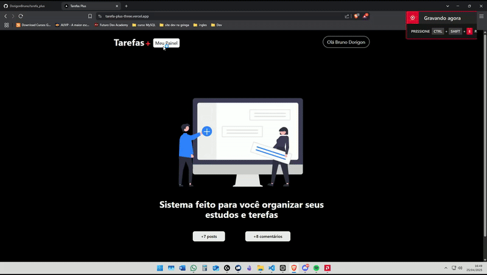

# Projeto Tarefa+ 🔖➕

O Projeto Tarefa Plus consiste em fazer um ToDo List só que tunado!!

É um projeto do curso <a href="https://sujeitoprogramador.com/fullstackpro/" target="_blank">FullStack Pro</a>. Onde o professor faz o projeto inteiro com a gente, mas eu assisti e fiz sozinho o meu e implementei coisas a mais como notificações.

Bom o projeto inteiro foi feito com NextJS e FireBase como bando de dados. Abordando o que o Next proporciona como verificações SSR antes de chegar ao front.

No projeto podemos fazer login, adicionar tarefas públicas ou não, adicionar comentários e exlcuir comentários e ver comentários de outros usuários.

Bom sinta-se a vontade para testar 🚀

# Passo a Passo 🦶
- Fazer Login
- Acessar o painel de dashboard
- Cadastrar uma tarefa ou mais
- Tem a opção de deixá-la pública ou não
- Tarefas que não são públicas só o usuário pode ver, outros não!
- Temos opção de deletar esta tarefa
- Podemos acessar tarefas públicas de outros usuários e fazer comentários
- Podemos Excluir nossos comentários.

# Tecnologias 🚀

- TypeScript 
- NextJS
- Firebase
- Next Auth JS
- Google Cloud (tive que fazer algumas configurações para rodar)
- TailwindCSS
- React Icons
- React Hot Toast (Notificações)
